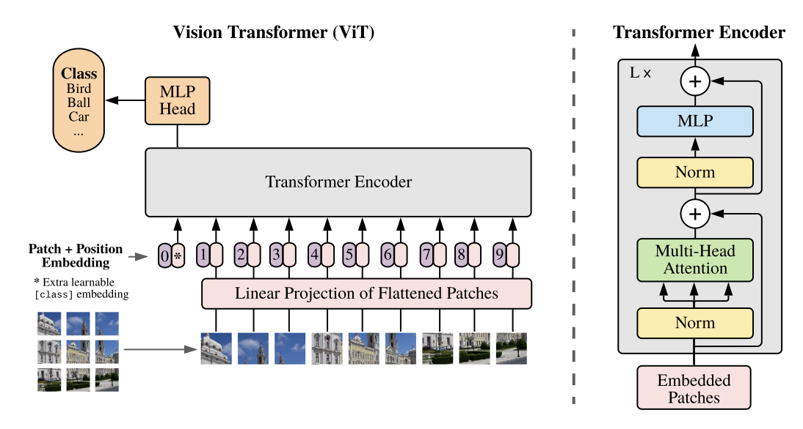

# Vision Transformers

- The standard transformer receives a 1D sequence of token embedding. To handle 2D images, we need to reshape then into a 1D tensor, which is done through the **Patch Embedding**.
    - When we train models such as BERT, we have a 1D sequence of text, and when we take embedding into account, the dimensionality is 2D i.e. including the batch dimensions, we have the `(batch_dimension, sequence_length, embedding_dimn)`. We want to have something like this for images as well.
    - One of the ways proposed was **Patch Embedding**. One way to implement this Patch Embeddings, and used by [HuggingFace's Transformers](https://github.com/huggingface/transformers/blob/73014b561d5f88d728e46a57d346f516fefe3f2d/src/transformers/models/vit/modeling_vit.py#L143) is through Convolutions.
    - We use a kernel size of `patch_size` and a stride of `patch_size` and effectively reducing the dimensionality by `patch_size`.
        - This converts the dimensions from `(batch_size, height, width, channels)` to `(batch_size, embedding_dim, height / patch_size, width / patch_size)`. We can convert this to `(batch_size, embedding_dim, (height * width) / (patch_size * patch_size))`. If further permute this tensor to `(batch_size, (height * width) / (patch_size * patch_size), embedding_dim)`, we get the ideal shape for transformers inputs in the form `(batch_size, sequence_length, embedding_dim)`.

